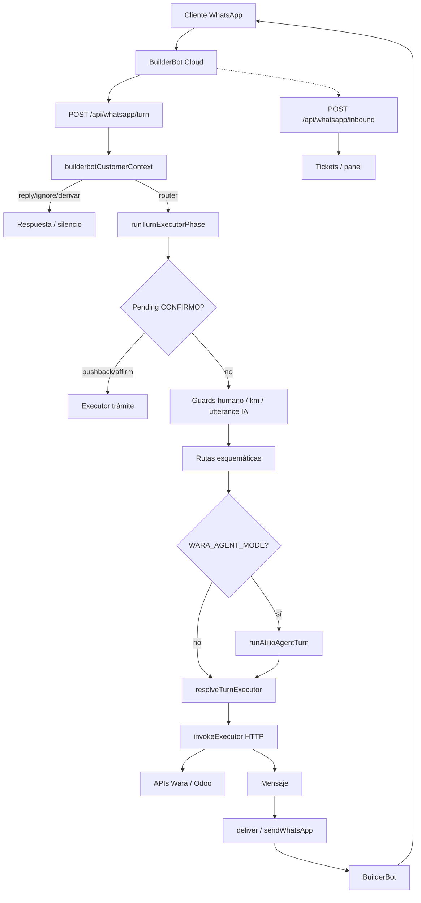

# WARA — Auditoría técnica del código conversacional actual

**Fecha:** 2026-08-11  
**Repositorio:** `empliados-support-desk`  
**Alcance:** Solo análisis y documentación. Ningún archivo de lógica fue modificado para esta auditoría salvo la creación de este documento.  
**Criterio de evidencia:** Toda afirmación con ruta/función citada está respaldada por el código del repo. Lo que no se pudo comprobar en runtime (valores de env en prod, cableado exacto de BuilderBot Cloud) se marca **no verificado**.

---

## 1. RESUMEN DEL SISTEMA

### 1.1 Stack tecnológico real (verificado en `package.json` y código)

| Capa | Tecnología |
|------|------------|
| Runtime app | Next.js **16.1.1**, React **19.2.3**, TypeScript |
| ORM / DB | Prisma **6.x** + PostgreSQL (`DATABASE_URL`) |
| IA | OpenAI SDK (`openai` ^6), modelo por defecto **gpt-4o-mini** |
| Validación | Zod |
| Hosting app | **Vercel** (scripts `build`: `prisma migrate deploy && next build`; dominio documentado en código/docs: `wara.nivel41.com`) |
| WhatsApp bridge | **BuilderBot Cloud** (HTTP desde flujos BBC hacia el backend) |
| Email | Resend (+ nodemailer en deps) |
| Storage | `@vercel/blob` |
| Auth panel | iron-session |

### 1.2 Servicios que lo componen

| Servicio | Responsabilidad |
|----------|-----------------|
| **BuilderBot Cloud** | Canal WhatsApp: recibe/envía mensajes; flujo **Inicio** llama al cerebro backend; no es el clasificador principal del turno (Fase 1: cerebro único en backend). |
| **Backend Next.js (este repo)** | Identidad/contexto, clasificación, executors, CONFIRMO, persistencia de tickets/hilo, panel de agentes, APIs Wara/Odoo. |
| **PostgreSQL** | Clientes, tickets, mensajes, agentes, `pendingAction`, `activeUnit`, `sessionNotebook`, prompts. |
| **Wara / Visionblo APIs** | Contactos por teléfono, flota, GPS/estado, odómetro/horómetro, certificados. |
| **Odoo Helpdesk** | Tickets de asesor/reclamo. |
| **OpenAI** | Clasificación, stance CONFIRMO, utterance, agente Atilio, guías, humanización, extracción odómetro, GPS summary. |
| **Vercel Cron** | Health check Wara cada 15 min (`vercel.json` → `/api/cron/wara-health`). |

### 1.3 Rol de BuilderBot

- Puente de transporte WhatsApp ↔ HTTP del backend.
- Scripts de sync en `scripts/sync-builderbot-*.mjs` (fuera del runtime del turno).
- Endpoints de apoyo: `/api/builderbot/customer-registered*`, prompts, files.
- **No verificado en este repo:** IDs exactos de flows BBC en producción ni el grafo completo de nodos BBC (viven en la nube BBC).

### 1.4 Rol del backend propio

Cerebro único del turno (`src/lib/whatsappTurn.ts` → `handleWhatsAppTurn`): contexto → (opcional defer) → `runTurnExecutorPhase` → entrega WhatsApp.

### 1.5 Rol de EasyPanel

**No verificado / no presente en este repositorio.** No hay referencias a EasyPanel, Dockerfile ni docker-compose. El deploy observable en código/config es **Vercel**. (EasyPanel aparece en otros proyectos Empliados fuera de este repo; no aplica a la mesa Wara según el código aquí.)

### 1.6 Bases de datos, colas, workers, externos

| Tipo | Hallazgo |
|------|----------|
| DB | PostgreSQL vía Prisma (`prisma/schema.prisma`) |
| Colas / workers | **No hay** cola dedicada tipo Bull/SQS. Hay `waitUntil` (Vercel) para defer del executor (`scheduleDeferredTurnExecutor` en `whatsappTurn.ts`). |
| Rate limit | In-memory por teléfono (`src/lib/phoneRateLimit.ts`) |
| Externos | Wara, Odoo, OpenAI, BuilderBot, Resend, Vercel Blob |

### 1.7 Diagrama textual del recorrido de un mensaje

```
Cliente WhatsApp
  → BuilderBot Cloud (flujo Inicio)
  → POST /api/whatsapp/turn   [auth API key]
      → handleWhatsAppTurn
          → persist inbound + thread
          → rate limit
          → customerRegisteredContextResponse  (empresa / reply / ignore / derivar)
          → [opcional] defer: ack + POST /api/whatsapp/turn/execute en background
          → runTurnExecutorPhase
              → pending CONFIRMO stance / affirmations
              → guards humanos / km bare / utterance IA
              → rutas esquemáticas (info, flota, odo…)
              → [opcional] runAtilioAgentTurn si WARA_AGENT_MODE
              → resolveTurnExecutor (safety → AI classify → classifyTurnExecutor)
              → invokeExecutor → /api/wara/* | /api/odoo/ticket | info-guides
          → deliverTurnToWhatsApp / sendWhatsAppMessage
  → BuilderBot entrega al cliente

Paralelo (panel/auditoría):
  POST /api/whatsapp/inbound  [sin API key en código]
      → tickets / mensajes / adjuntos / auto-assign
```

---

## 2. PUNTOS DE ENTRADA

### 2.1 `POST /api/whatsapp/turn`

| Campo | Valor |
|-------|--------|
| Archivo | `src/app/api/whatsapp/turn/route.ts` |
| Función | `POST` → `handleWhatsAppTurn` (`src/lib/whatsappTurn.ts`) |
| Auth | `requireBuilderBotContextAuth` + `validateContextSecret` (claves vía env `PULZE_API_KEY` / `BUILDERBOT_CONTEXT_API_KEY` / `API_KEY` / `N8N_API_KEY`) |
| Payload (zod) | `phone`\|`from`, `body`\|`rawText`\|`message`, api key opcional en body |
| Validaciones | Auth; teléfono ≥8; si sin auth config → 503 |
| Siguiente | `handleWhatsAppTurn` |
| Respuesta | Sí (JSON con mensaje / flags skip) |
| Operaciones | Sí (vía executor síncrono o diferido) |
| Doble proceso | Mitigado por `shouldIgnoreDuplicateInicioTurn`; **riesgo residual** si BBC reintenta con body distinto o sin dedupe estable |

### 2.2 `POST /api/whatsapp/turn/execute`

| Campo | Valor |
|-------|--------|
| Archivo | `src/app/api/whatsapp/turn/execute/route.ts` |
| Función | `POST` → `runTurnExecutorPhase` + `sendWhatsAppMessage` + `persistCustomerBotReply` |
| Auth | Igual que `/turn` |
| Payload | Igual schema; body vacío → 400 |
| `maxDuration` | 120 |
| Respuesta | Envía WhatsApp desde backend |
| Doble proceso | Si se llama dos veces con el mismo mensaje puede **duplicar** respuesta; depende de BBC/caller. Dedup parcial vía outbound (`outboundMessageDedup.ts`). |

### 2.3 `POST /api/whatsapp/inbound`

| Campo | Valor |
|-------|--------|
| Archivo | `src/app/api/whatsapp/inbound/route.ts` |
| Función | `POST` → `processIncomingMessage` / `processOutgoingMessage` |
| Auth | **Sin validación de API key en el código leído** |
| Payload | Eventos `message.incoming` / outgoing; `from`, `body`, adjuntos |
| Validaciones | Rate limit; resolución cliente Wara; dedup `externalMessageId` |
| Respuesta al cliente | Auto-reply en algunos caminos; no es el cerebro principal del turno Fase 1 |
| Operaciones | Tickets, assign, adjuntos, transcripción |
| Doble proceso | Dedup por `externalMessageId` + catch P2002; outgoing también ventana 8s |

### 2.4 BuilderBot (lado nube)

- Invoca `/api/whatsapp/turn` (y potencialmente `/turn/execute`) — **cableado exacto no verificado en este repo** (configuración BBC externa).
- Endpoints locales de apoyo:  
  - `src/app/api/builderbot/customer-registered/route.ts`  
  - `.../check/route.ts`  
  - `.../select-company/route.ts`  
  - `.../[phone]/context/route.ts`  
  - `prompts`, `files`

### 2.5 Router / execute (libs, no HTTP directo del cliente)

- `src/lib/whatsappTurnRouter.ts` — `classifyTurnExecutor`, `TURN_EXECUTOR_PATH`, `TURN_SAFETY_GUARD_RULE_IDS`
- `src/lib/whatsappTurnExecutor.ts` — `runTurnExecutorPhase`

### 2.6 Ejecutores HTTP internos

| Ruta | Archivo |
|------|---------|
| `/api/wara/unidades` | `src/app/api/wara/unidades/route.ts` |
| `/api/wara/odometro-horometro` | `src/app/api/wara/odometro-horometro/route.ts` |
| `/api/wara/certificados` | `src/app/api/wara/certificados/route.ts` |
| `/api/wara/mantenimiento-operativo` | `src/app/api/wara/mantenimiento-operativo/route.ts` |
| `/api/wara/info-guides` | `src/app/api/wara/info-guides/route.ts` |
| `/api/odoo/ticket` | `src/app/api/odoo/ticket/route.ts` |

---

## 3. RECORRIDO DE UN MENSAJE

### 3.1 Orden en `handleWhatsAppTurn` (`whatsappTurn.ts`)

1. Body vacío → reusar último inbound / ignore dup Inicio.  
2. `persistCustomerInbound`.  
3. `loadTurnThreadContext`.  
4. `allowPhoneRequest(phone, 20)` — rate limit.  
5. `customerRegisteredContextResponse` (`builderbotCustomerContext.ts`): registro, multiempresa, pausa bot, menús enlatados acotados, CONFIRMO → router, etc.  
6. Si `nextFlow` ∈ {`ignore`,`derivar`,`reply`} → corta (con bypasses).  
7. Flow control hard reset (`looksLikeFlowControlCommand`) → limpia pending.  
8. Si `shouldDeferTurnExecutor()` → programa `/turn/execute` y responde ack vacío al BBC.  
9. Else `runTurnExecutorPhase` → `deliverTurnToWhatsApp`.

### 3.2 Orden en `runTurnExecutorPhase` (`whatsappTurnExecutor.ts`)

1. Cambio de empresa.  
2. Load pending + thread.  
3. **Pending confirm pushback** (`pendingConfirmStance`) si hay CONFIRMO + rechazo/defer.  
4. Rechazo unidad (solo con contexto de aclaración).  
5. Humano / reclamo / out-of-scope → `odoo_ticket`.  
6. Bare km/hs → `odometro`.  
7. Affirmation CONFIRMO + pending → executor directo (**nunca silencio**).  
8. Confirm breve solo si hay pending/odómetro confirm real.  
9. **Utterance IA** si `shouldInterpretAmbiguousUtterance`.  
10. Rutas esquemáticas (info_guides, fleet list, odometro, unidades).  
11. **Agente Atilio** si `WARA_AGENT_MODE` y condiciones de `runAtilioAgentTurn`.  
12. Default: `resolveTurnExecutor` → `invokeExecutor` → recovery/fallbacks.

### 3.3 Clasificación final (`resolveTurnExecutor` / `classifyTurnExecutor`)

1. Safety guards (`TURN_SAFETY_GUARD_RULE_IDS`) — no se delegan a IA.  
2. Opcional: clasificador IA (`whatsappTurnClassifierAI.ts`) si `WARA_TURN_AI_CLASSIFY` no lo desactiva.  
3. Reglas ordenadas `TURN_RULES` en `whatsappTurnRouter.ts`.  
4. **Default:** `"unidades"`.

### 3.4 Quién gana si hay conflicto

| Conflicto | Decisión final (código) |
|-----------|-------------------------|
| CONFIRMO affirmation + pending | Executor del pending (`resolvePendingConfirmationExecutor` / `pendingAction`) **antes** del agente y del default |
| Safety guard vs AI classify | Safety guard |
| BuilderBot context `reply` vs turn | Context corta el turn si `nextFlow=reply` |
| Agente vs reglas esquemáticas | Rutas esquemáticas y pending se evalúan **antes** del agente |
| Heurística “otra consulta” vs menú capacidades | Menú solo si `looksLikeExplicitCapabilityMenuRequest`; resto → router/IA (`builderbotCustomerContext.ts`, `verify-ai-first-dialogue.mjs`) |
| Regex hilo vs `pendingAction` DB | DB prioriza lectura; regex sigue como fallback (`pendingAction.ts` comentarios) |

---

## 4. INVENTARIO DE HEURÍSTICAS

> Hay **decenas** de `looksLike*` / `hasPending*` / `should*` en `wara.ts`, `waraApi.ts`, `waraUnitIntent.ts`. Abajo: las de mayor impacto conversacional. Inventario exhaustivo línea-a-línea de las ~100 funciones equivaldría a un anexo de API; las firmas exportadas están listables por grep `export function looksLike|hasPending|should`.

### 4.1 Pre-IA / pre-router (Inicio)

| Función | Archivo | Intento | Antes/después IA | Puede sobrescribir | Riesgo |
|---------|---------|---------|------------------|--------------------|--------|
| `looksLikeExplicitCapabilityMenuRequest` | `waraApi.ts` | Menú “qué puedo hacer” | Antes | Corta turn con panfleto | Bajo si solo menú explícito |
| `looksLikeGenericCapabilityOrTopicSwitchRequest` | `waraApi.ts` | Topic switch / ayuda | Antes → ahora **router** | Evita GPS zombie | Medio si mal clasifica |
| `looksLikeGreeting` | `waraApi.ts` | Saludo | Antes; mid-pending → router | Reinicio de tono | Medio mid-flujo |
| `looksLikeFlowControlCommand` | `waraApi.ts` | Reinicio duro | Antes; pending → router | Limpia pending | Alto si se amplia de más |
| `looksLikeThanksOnlyAcknowledgement` | `waraApi.ts` | “Gracias” | Antes | Cierre social | Bajo |
| `looksLikeConversationAcknowledgement` | `waraApi.ts` | ok/listo/gracias | Pending → polite CONFIRMO | Confunde ok con cierre | Histórico: alto; mitigado |
| `looksLikeCompanySelection` / change company | `waraApi.ts` | Multiempresa | Antes | Cambia empresa | Medio |
| `hasAnyPendingConfirmation` + affirmation | `pendingConfirmation.ts` + context | CONFIRMO | Antes | Fuerza router | Necesario (safety) |

### 4.2 Pending CONFIRMO

| Función | Archivo | Intento | IA | Riesgo |
|---------|---------|---------|----|--------|
| `looksLikePendingConfirmPushback` | `pendingConfirmStance.ts` | Abrir stance | Dispara IA stance | Medio |
| `looksLikeOdometerConfirmationRejection` | `waraApi.ts` | Cancelar odo | Antes/en executor | Medio |
| `looksLikePendingConfirmDeferForOtherQuery` | `waraApi.ts` | Pausa para consulta | Antes + IA | Medio (ambigüedad desestima) |
| `hasPendingOdometerConfirmation` / cert / maint | `wara.ts` | Inferir pending del hilo | Fallback a DB | Alto si hilo “superseded” mal |
| `isOdometerFlowSuperseded` | `wara.ts` | Abandonar flujo odo | Puede silenciar | **Crítico histórico** (mitigado 2026-08-10) |
| `resolvePendingConfirmationExecutor` | `pendingConfirmation.ts` | Prioridad cert→odo→maint | Safety | Correcto si pending claro |

### 4.3 Unidades / flota

| Función | Archivo | Riesgo |
|---------|---------|--------|
| `shouldRouteTurnToUnidadesExecutor` | `waraUnitIntent.ts` | Default fuerte a unidades |
| `looksLikeFleetUnitSearchInput` | `waraUnitIntent.ts` | Confundir códigos internos |
| `looksLikeAmbiguousUnitCodeToken` | `waraUnitIntent.ts` | Mitiga 600-006 como patente |
| `looksLikeUnitRejection` / bare negative | `wara.ts` | Solo con contexto aclaración en executor |
| Default `classifyTurnExecutor` → `unidades` | `whatsappTurnRouter.ts` | **Alto:** mensaje no matcheado cae a flota |

### 4.4 Odómetro / cert / maint keywords

Numerosas en `wara.ts`: `looksLikeOdometerIntentStart`, `looksLikeStructuredOdometerUpdateRequest`, `looksLikeCertificateKeyword`, `looksLikeMaintenanceKeyword`, `shouldContinueOdometerFlow`, etc. Se ejecutan **antes** del agente en rutas esquemáticas. Riesgo: secuestro de tema / skip silencioso (`skipResponse_s` en `odometro-horometro/route.ts`).

---

## 5. USO REAL DE INTELIGENCIA ARTIFICIAL

| Archivo / función | Modelo | Prompt | Contexto | Salida | Params | Si falla | Anulable después | Tools | Memoria |
|-------------------|--------|--------|----------|--------|--------|----------|------------------|-------|---------|
| `whatsappTurnClassifierAI.ts` `classifyTurnExecutorWithAI` | gpt-4o-mini | System inline + executors | texto + thread | JSON executor | temp 0.05 | Heurística router | Sí (guards ya pasaron) | No | Thread corto |
| `utteranceUnderstanding.ts` `understandUserUtterance` | `WARA_UTTERANCE_MODEL` \| mini | System inline | msg + thread | JSON intent | 0.1 | Null / no fuerza | Sí | No | Thread |
| `pendingConfirmStance.ts` `reasonPendingConfirmationRejection` | `WARA_PENDING_CONFIRM_MODEL` \| utterance \| mini | System stance | thread + msg | JSON action | 0.1 | Heurística stance | Executor aplica | No | Thread |
| `atilioAgent.ts` `runAtilioAgentTurn` | `WARA_AGENT_MODEL` \| mini | `CORE_SYSTEM_PROMPT` + módulos DB | hilo + tools | texto + tool calls | 0.55/0.5 | Fallback no agent | Rutas previas ya ganaron | **Sí** (`atilioAgentTools.ts`) | Hilo + activeUnit + pending |
| `atilioDialogueCompose.ts` | mismo | Compose desde dialogue_state | state | texto | 0.5 | Template | — | No | State |
| `odometerDialogueAI.ts` | mini | Situaciones odo | history | texto (exige CONFIRMO si summary) | 0.4 | Template | Validación tokens | No | History |
| `odometroHorometroExtract.ts` | mini | Extract fields | texto | JSON | 0.05 | Regex/parse | — | No | Msg |
| `waraUnitIntent.ts` (AI clarify) | mini | Resolve unidad | texto+flota | JSON | 0.1 | Rules | — | No | Parcial |
| `fleetListIntentAI.ts` | mini | ¿Listado? | texto+thread | JSON | 0 | Heurística | — | No | Thread |
| `whatsappAdminIntentAI.ts` | mini | ¿Cambiar empresa? | texto | JSON | 0 | Heurística | — | No | — |
| `waraGpsSummary.ts` | mini | Resumen GPS | unit data | texto | 0.2 | Template | — | No | — |
| `knowledgeBaseAI.ts` | mini | Guía grounded | KB + q | texto | 0.2 | Static guide | — | No | — |
| `botReplyHumanizer.ts` | mini | Humanizar | draft | texto | 0.3 | Original | — | No | — |
| `openai.ts` (panel summaries) | mini | Resumen ticket | mensajes | texto | 0.3 | — | — | No | Ticket |

**Flags de feature (nombres):** `WARA_AGENT_MODE`, `WARA_TURN_AI_CLASSIFY`, `WARA_PENDING_CONFIRM_IA_ENABLED`, `WARA_UTTERANCE_UNDERSTANDING`, `WARA_DIALOGUE_AI_ODOMETRO`, `WARA_ODOMETER_AI_EXTRACT`, `WARA_FLEET_LIST_INTENT_AI`, `WARA_ADMIN_INTENT_AI`, `WARA_HUMANIZE_REPLIES`, `WARA_CONVERSATION_NOTEBOOK`.

**Prompts editables en DB:** modelo `BotPromptModule` (`prisma/schema.prisma`); panel `/configuracion`.

---

## 6. ESTADO Y MEMORIA CONVERSACIONAL

### 6.1 Modelos Prisma relevantes (`prisma/schema.prisma`)

**No existe** modelo `Conversation` separado. El “hilo” se reconstruye de `TicketMessage` (+ texto para clasificación).

#### `Customer`

| Campo | Uso |
|-------|-----|
| `phone` | Clave WhatsApp |
| `companyName`, `selectedCompanyContactId` | Empresa activa |
| `waraSessionToken`, `waraSessionAt` | Sesión Wara |
| `botPausedAt` | Pausa bot (asesor humano) |
| `pendingAction` Json? | Trámite CONFIRMO (TTL 45 min en `pendingAction.ts`) |
| `activeUnit` Json? | Unidad activa (TTL 45 min en `activeUnit.ts`) |
| `sessionNotebook` Json? | Cuaderno sesión (`conversationNotebook.ts`; flag `WARA_CONVERSATION_NOTEBOOK`) |

#### `Ticket` / `TicketMessage`

- Ticket: status, priority, incidentType, assignedTo, aiSummary, channel WHATSAPP.  
- Message: direction, from (CUSTOMER/BOT/HUMAN), text, `externalMessageId` unique, attachments, rawPayload.

#### `AgentUser`

- `sessionActive`, `lastSeenAt`, `casesReleaseAt`, `bot` pause está en Customer no en Agent.

### 6.2 Quién crea / modifica / elimina

| Estado | Crea | Modifica | Limpia | Duración | Aislamiento |
|--------|------|----------|--------|----------|-------------|
| `pendingAction` | Executors odo/cert/maint vía `setPendingAction` | Amend en odo | `clearPendingAction` (confirm, cancel, flow reset) | 45 min | Por teléfono/customer |
| `activeUnit` | Tras resolución exitosa | Update plate | clear / TTL | 45 min | Por customer |
| `botPausedAt` | Panel / `atilioBotPause` | — | Reactivar / close flows | Hasta clear | Por customer |
| Empresa | select-company | change company | reset menú | Sesión | Por customer |
| Hilo | inbound + outbound persist | — | no borra histórico | — | Por customer/tickets |
| Odómetro “estado” | Inferido hilo + pending + notebook | — | superseded / clear | Hilo+TTL | Por customer |
| Cert/Maint pending | pendingAction + regex hilo | — | clear | 45 min + hilo | Por customer |

### 6.3 Cambio de empresa / unidad / mensajes seguidos

- Cambio empresa: limpia menú/contexto (`resetCustomerCompanyMenu`); pending puede limpiarse en flow control.  
- Cambio unidad: `shouldClearOdometerPlateFromThread`, rejection paths, nueva resolución.  
- Mensajes seguidos: rate limit; defer executor; **no hay lock distribuido** por turno — riesgo de carrera si dos turns solapan (**ver §10**).

---

## 7. CONFIRMACIONES

### 7.1 Flujo común

1. Executor completa datos → arma resumen → `setPendingAction` → pide **CONFIRMO**.  
2. Prioridad (`pendingConfirmation.ts`): **certificados → odometro → mantenimiento**.  
3. Affirmation → executor registra / genera.  
4. Pushback → `reasonPendingConfirmationRejection` (IA + heurística).

### 7.2 Odómetro (`odometro-horometro/route.ts`)

- Requiere patente + (km|hs) + **fecha y hora**.  
- Sin fecha/hora: no CONFIRMO.  
- Confirm: lee `getPendingAction` payload + summary del hilo.  
- Rejection: `looksLikeOdometerConfirmationRejection` → clear + mensaje.  
- `skipResponse_s` si superseded / topic change **excepto** affirmation CONFIRMO (guard añadido).

### 7.3 Certificados / Mantenimiento

- Patrones análogos: resumen + CONFIRMO; cancel/reject helpers en rutas y `waraApi.ts`.  
- Mantenimiento: ticket local + Odoo; no OT Wara por API (documentado en código/docs generados).

### 7.4 Matriz: mientras se espera CONFIRMO

| Usuario hace… | Comportamiento código (verificado) |
|---------------|-------------------------------------|
| Confirma (`CONFIRMO`, sí, dale…) | `looksLikePendingTramiteAffirmation` → executor |
| Rechaza / no confirmo / cancelar (odo) | Rejection → clear |
| “Otra consulta” / defer | `pause_for_side_query` — **no borra** pending; pide dato / ejecuta consulta + reminder |
| Pregunta GPS misma unidad | Puede pause + unidades + reminder |
| Corrige km/patente | Amendment paths en odo (`looksLikeOdometerPendingDataAmendment`) |
| Cambia patente | correct_unit / plate correction |
| Cambia de tema fuerte | Puede `cancel_tramite` o superseded (riesgo histórico) |
| “sí, pero antes…” | **Parcialmente** cubierto por stance IA; no hay parser dedicado — **inferencia** |
| Varios mensajes seguidos | Race posible sin lock |
| Hablar con persona | Guard → `odoo_ticket` (prioridad alta en executor) |

### 7.5 Loops conocidos (mitigados / residuales)

- Capacidades del bot marcando `isOdometerFlowSuperseded` → CONFIRMO silencio (**mitigado** cue “sigue pendiente”).  
- Default a `unidades` tras mensaje ambiguo.  
- Agente vs pending: pending gana si se detecta.

---

## 8. EXECUTORS Y OPERACIONES

| Executor | Input | Validaciones | Efecto real | Endpoint | Idempotencia | Conversación vs operación |
|----------|-------|--------------|-------------|----------|--------------|---------------------------|
| `unidades` | phone, body, thread | Cliente Wara, flota, plate resolve | Consulta estado; puede abrir ticket Odoo por incident | Wara ConsultarEstadoUnidades | Dedup keys en escalación | Texto GPS + links |
| `odometro` | phone, body | Plate, km/hs, fecha+hora, CONFIRMO | `registrarCambioOdometroHorometro` | Wara API | Pending+clear post éxito; reintento CONFIRMO puede reintentar API — **riesgo si Wara no idempotente (no verificado API Wara)** | Diálogo AI + templates |
| `certificados` | phone, body | Plate, empresa, CONFIRMO | Pedido certificado Wara | Wara | Similar pending | Texto + link/archivo |
| `mantenimiento` | phone, body | Plate, tipo, detalle, CONFIRMO | Ticket panel + Odoo | Odoo + local | dedupeKey | Resumen CONFIRMO |
| `odoo_ticket` | phone, body | Intent humano/reclamo | Ticket Odoo + assign | `/api/odoo/ticket` | ensureWaraOdooTicket dedupe | Mensaje handoff |
| `info_guides` | phone, body | Tipo guía | Ninguna mutación flota | KB/AI | N/A | Solo texto |

**Separación:**  
- **Operación:** llamadas Wara/Odoo + `setPendingAction`/`clearPendingAction`.  
- **Conversación:** `composeOdometerDialogueReply`, `waraGpsSummary`, `humanizeBotReply`, agente Atilio, templates en rutas.

---

## 9. AGENTE ATILIO

| Pregunta | Respuesta verificada |
|----------|----------------------|
| Dónde | `src/lib/atilioAgent.ts`, tools `atilioAgentTools.ts`, compose `atilioDialogueCompose.ts` |
| Cómo | `runAtilioAgentTurn` desde `whatsappTurnExecutor` |
| Cuándo | `WARA_AGENT_MODE=true` + `OPENAI_API_KEY`; condiciones `shouldRequireToolCall` / early returns |
| Cuándo no | Feature off; o rutas pending/safety/esquemáticas ya respondieron antes |
| System prompt | `CORE_SYSTEM_PROMPT` (+ appendix `BotPromptModule`) |
| Tools | `consultar_unidades`, `registrar_odometro_horometro`, certificados, mantenimiento, derivar, guía — ver `ATILIO_AGENT_TOOLS` |
| Memoria | Thread + activeUnit + pendingAction + notebook si enabled |
| Ejecuta acciones | Sí, vía tools que llaman los mismos executors HTTP |
| Relación router | **No gobierna todos los turnos**; es una ruta alternativa **después** de pending/guards/esquemáticas |
| Relación heurísticas | Heurísticas pueden impedir que llegue al agente |

---

## 10. CONCURRENCIA E IDEMPOTENCIA

| Mecanismo | Dónde | Nota |
|-----------|-------|------|
| `externalMessageId` unique | `TicketMessage` + inbound | Dedup webhook |
| `buildWebhookMessageId` | `webhookMessageId.ts` | Estabilidad WA id |
| Outbound dedup 8s | `outboundMessageDedup.ts` / inbound outgoing | Anti-doble envío panel |
| Dedupe Inicio turn | `shouldIgnoreDuplicateInicioTurn` | BBC re-ejecuciones |
| Rate limit memoria | `phoneRateLimit.ts` | No distribuido entre instancias |
| Odoo/Wara dedupeKey | `waraOdooEscalation.ts` | Tickets |
| Locks DB por turno | **No encontrado** | Riesgo mensajes consecutivos |
| Cola | Solo `waitUntil` defer | No worker durable |
| Doble CONFIRMO | Clear pending tras éxito; segundo CONFIRMO sin pending → otro camino | Depende Wara |
| Corrección mid-ejecución | Amend paths odo; no cancela HTTP en vuelo | Race residual |

---

## 11. PANEL Y DERIVACIÓN HUMANA

| Tema | Evidencia |
|------|-----------|
| Pausar bot | `Customer.botPausedAt`; `atilioBotPause.ts`; panel ticket actions |
| Derivar persona | Guards → `odoo_ticket`; tool `derivar_asesor_ticket`; assign advisors |
| Retomar bot | Clear `botPausedAt` / flujos close (`verify-atilio-reactivate-on-close.mjs`) |
| Pending al pausar | **No verificado** un clear automático universal al pausar; pending puede quedar en DB hasta TTL/clear |
| Detección escalar | Heurísticas humano/reclamo/out-of-scope + agente tool + GPS tickets auto |

---

## 12. PRUEBAS ACTUALES

- **~133** scripts `scripts/verify-*.mjs`.  
- Gate pre-push: `scripts/verify-push.mjs` (~38 suites).  
- Suite completa: `scripts/verify-all.mjs` / `npm test`.  
- Mayoría: **unitarias/determinísticas** con `tsx`, **sin red** (mocks de funciones).  
- Algunas smoke (`verify-meeting-wara-smoke.mjs`) pueden tocar entorno — revisar antes de asumir.

### Cobertura multi-turno (ejemplos existentes)

| Escenario | Scripts ejemplo |
|-----------|-----------------|
| CONFIRMO + gracias | `verify-odometer-gracias-pending-confirm.mjs` |
| Defer otra consulta | `verify-odometer-defer-other-query.mjs` |
| No cancela a patente | `verify-maintenance-confirm-no-cancels.mjs` |
| AI-first menú | `verify-ai-first-dialogue.mjs` |
| Continuidad cert/odo | `verify-certificate-flow-continuity.mjs`, `verify-odometer-plate-continuity.mjs` |
| Active unit | `verify-active-unit-memory.mjs`, `verify-session-unit-continuity.mjs` |

### Huecos típicos (no verificados como suites dedicadas E2E WhatsApp real)

- Dos turns concurrentes mismos phone.  
- Webhook inbound + turn simultáneos.  
- “sí, pero antes…” multi-intención en un solo mensaje (parcial).  
- Reintentos BBC `/turn/execute` duplicados.  
- Fallo Wara mid-CONFIRMO con retry.  
- EasyPanel (N/A).  

---

## 13. DEPENDENCIAS Y DESPLIEGUE

| Ítem | Hallazgo |
|------|----------|
| Dockerfile / compose | **No existen** |
| EasyPanel | **No en repo** |
| Build | `prisma migrate deploy && next build` |
| Start | `next start` (Vercel serverless) |
| Migraciones | `prisma/migrations/` |
| Cron | `/api/cron/wara-health` cada 15 min; auth `CRON_SECRET` |
| Health | Cron + `verify-system-health.mjs` |
| Dominio | Documentado `wara.nivel41.com` — **DNS exacto prod: no verificado desde código** |

### Variables de entorno (solo nombres)

`DATABASE_URL`, `OPENAI_API_KEY`, `API_KEY`, `PULZE_API_KEY`, `BUILDERBOT_CONTEXT_API_KEY`, `BUILDERBOT_API_KEY`, `BUILDERBOT_API_URL`, `BUILDERBOT_BASE_URL`, `BUILDERBOT_BOT_ID`, `BUILDERBOT_BOT_URL`, `BUILDERBOT_ANSWER_ID`, `BUILDERBOT_DASHBOARD_TOKEN`, `N8N_API_KEY`, `CRON_SECRET`, `WARA_API_BASE_URL`, `WARA_MAINTENANCE_API_BASE_URL`, `WARA_OBTENER_EMPRESA_TOKEN`, `WARA_AGENT_MODE`, `WARA_AGENT_MODEL`, `WARA_TURN_AI_CLASSIFY`, `WARA_TURN_DEFER_EXECUTOR`, `WARA_TURN_BACKEND_SEND`, `WARA_TURN_BASE_URL`, `WARA_PENDING_CONFIRM_IA_ENABLED`, `WARA_PENDING_CONFIRM_MODEL`, `WARA_UTTERANCE_MODEL`, `WARA_UTTERANCE_UNDERSTANDING`, `WARA_DIALOGUE_AI_ODOMETRO`, `WARA_ODOMETER_AI_EXTRACT`, `WARA_FLEET_LIST_INTENT_AI`, `WARA_ADMIN_INTENT_AI`, `WARA_HUMANIZE_REPLIES`, `WARA_CONVERSATION_NOTEBOOK`, `WARA_INBOUND_AUDIT_ONLY`, `WARA_OPS_ALERT_EMAIL`, `WARA_TEST_ALLOWED_PHONES`, `WARA_TEST_IMPERSONATE_MAP`, `WARA_PRUEBAS_FALLBACK_EL_CACIQUE`, `VERCEL_ENV`, `VERCEL_URL`.

---

## 14. MAPA DE ARCHIVOS CRÍTICOS

| Archivo | Responsabilidad | Funciones clave | Dependencias | Riesgo al tocar | Reutilizable V2 |
|---------|-----------------|-----------------|--------------|-----------------|-----------------|
| `whatsappTurn.ts` | Orquestación turno | `handleWhatsAppTurn` | context, executor, delivery | **Alto** | Parcial |
| `whatsappTurnExecutor.ts` | Fase execute | `runTurnExecutorPhase` | todos los libs | **Crítico** | Parcial |
| `whatsappTurnRouter.ts` | Reglas + paths | `classifyTurnExecutor` | wara* | **Alto** | Parcial (lista reglas) |
| `builderbotCustomerContext.ts` | Pre-router Inicio | `customerRegisteredContextResponse` | wara, pending | **Alto** | Parcial |
| `pendingConfirmStance.ts` | Stance CONFIRMO | `reasonPendingConfirmationRejection` | OpenAI, wara | **Alto** | Sí (patrón) |
| `pendingAction.ts` | Estado DB pending | get/set/clear | Prisma | Medio | Sí |
| `pendingConfirmation.ts` | Prioridad CONFIRMO | `resolvePendingConfirmationExecutor` | wara | Medio | Sí |
| `wara.ts` / `waraApi.ts` | Heurísticas + cliente Wara | looksLike*, API | OpenAI, Prisma | **Crítico** (tamaño) | Parcial |
| `waraUnitIntent.ts` | Resolución unidad | `resolveUnitQuery` | Wara, OpenAI | **Alto** | Parcial |
| `odometro-horometro/route.ts` | Executor odo | POST | pending, Wara | **Crítico** | Parcial |
| `unidades/route.ts` | Executor flota | POST | Wara, Odoo | **Alto** | Parcial |
| `certificados/route.ts` | Executor cert | POST | Wara | Alto | Parcial |
| `mantenimiento-operativo/route.ts` | Executor maint | POST | Odoo | Alto | Parcial |
| `odoo/ticket/route.ts` | Handoff | POST | Odoo | Alto | Parcial |
| `atilioAgent.ts` | Agente tools | `runAtilioAgentTurn` | OpenAI, tools | Alto | Sí si se generaliza |
| `inbound/route.ts` | Webhook panel | processIncoming/Outgoing | Prisma | Alto | Parcial |
| `activeUnit.ts` | Memoria unidad | get/set/TTL | Prisma | Medio | Sí |
| `conversationThread.ts` | Hilo classify | loadTurnThreadContext | Prisma | Medio | Sí |
| `prisma/schema.prisma` | Modelo datos | — | — | **Crítico** | Base |

---

## 15. HALLAZGOS

### Crítico

1. **Dos cerebros posibles (turn vs inbound)**  
   - Evidencia: `/api/whatsapp/turn` y `/api/whatsapp/inbound` independientes; inbound **sin API key** en código.  
   - Consecuencia: auditoría/auto-reply puede divergir del turn.  
   - Ejemplo: mensaje genera ticket inbound mientras turn responde otra cosa.  
   - Componente: `inbound/route.ts` + BBC.

2. **Default a `unidades`**  
   - Evidencia: `classifyTurnExecutor` default `"unidades"` (`whatsappTurnRouter.ts`).  
   - Consecuencia: mensajes no clasificados → consulta flota / GPS.  
   - Ejemplo histórico: “otras consultas” → GPS unidad activa.  
   - Componente: router.

### Alto

3. **Heurísticas masivas pre-IA** (`wara.ts` ~2500 LOC, `waraApi.ts` ~3600 LOC)  
   - Consecuencia: diálogo frágil; cambios locales con efectos globales.  
   - Componente: libs wara*.

4. **Sin lock de turno / rate limit solo in-memory**  
   - Evidencia: `phoneRateLimit.ts`; no mutex por phone en DB.  
   - Consecuencia: mensajes consecutivos pueden solapar executors.  
   - Componente: turn + Vercel multi-instancia.

5. **`isOdometerFlowSuperseded` + skip silencioso**  
   - Evidencia: `odometro-horometro/route.ts` `skipResponse_s`.  
   - Consecuencia: usuario sin respuesta (incidente 2026-08-10; mitigaciones parciales).  
   - Componente: odometro route + `wara.ts`.

6. **Agente Atilio no gobierna el turno completo**  
   - Evidencia: se invoca tarde y solo con flag.  
   - Consecuencia: “IA-first” parcial; heurísticas siguen mandando.  
   - Componente: `whatsappTurnExecutor` + `atilioAgent`.

### Medio

7. **Pending dual (DB + regex hilo)** — inconsistencias posibles.  
8. **Defer `/turn/execute`** — doble envío si caller reintenta.  
9. **Prompt del agente largo + tools limitados (2 rounds)** — puede quedarse corto en multi-paso.  
10. **Menú capacidades / topic-switch** — comportamiento cambió a IA-first; regresión de panfleto intencional.

### Bajo

11. Docs Word/scripts de generación no son runtime.  
12. EasyPanel no aplica a este repo.  
13. Monitor `/monitor` solo lectura — fuera del núcleo conversacional.

---

## 16. ANEXOS

### 16.1 Árbol relevante (parcial)

```
src/app/api/whatsapp/{turn,turn/execute,inbound}/
src/app/api/wara/{unidades,odometro-horometro,certificados,mantenimiento-operativo,info-guides,diag,confirmo}/
src/app/api/odoo/ticket/
src/app/api/builderbot/...
src/lib/{whatsappTurn*,pending*,wara*,atilio*,activeUnit,conversationThread,conversationNotebook}.ts
prisma/schema.prisma
scripts/verify-*.mjs
vercel.json
```

### 16.2 Executors

`unidades` | `odometro` | `certificados` | `mantenimiento` | `odoo_ticket` | `info_guides`

### 16.3 Endpoints WhatsApp / turn

- `POST /api/whatsapp/turn`  
- `POST /api/whatsapp/turn/execute`  
- `POST /api/whatsapp/inbound`  

### 16.4 Prompts

- Inline: classifier, utterance, stance, odometer dialogue, GPS, KB, humanizer, agent `CORE_SYSTEM_PROMPT`.  
- DB: `BotPromptModule`.  
- Archivos texto legacy sync BBC: `scripts/*_prompt.txt` (si existen; sync scripts).

### 16.5 Diagrama Mermaid (recorrido actual)



### 16.6 Separación hechos vs inferencias

| Hecho comprobado en repo | Inferencia / no verificado |
|--------------------------|----------------------------|
| Rutas, libs, Prisma, flags env, suites verify | Valores reales de env en Vercel |
| Orden de código en turn/executor | Grafo exacto de nodos BBC Cloud |
| Ausencia EasyPanel/Docker en repo | Infra de otros productos Empliados |
| Mitigaciones CONFIRMO silencio en código | Que prod tenga el commit desplegado en un instante dado (verificar deploy) |
| Idempotencia pending clear | Semántica exacta de APIs Wara ante doble POST |

---

*Fin del documento de auditoría. No incluye propuesta de arquitectura V2 ni cambios de código.*
