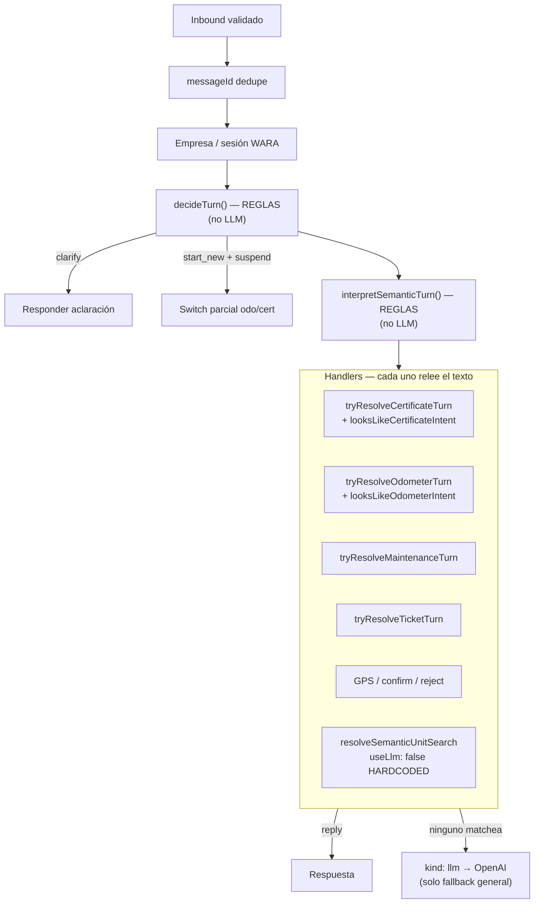

# Diagnóstico — cerebro conversacional V2 (Etapa 1)

**Estado:** solo diagnóstico + diseño. **Sin corrección arquitectónica. Sin deploy.**  
**Fecha:** 2026-08-12  
**SHA base lab:** `0efd7f0` (+ instrumentación local de trace, no desplegada)  
**Flag:** `WARA_V2_SEMANTIC_TRACE=true`  
**Evidencia:** `docs/v2/V2-SEMANTIC-TRACE-CASOS-AE.json`  
**Script:** `apps/wara-v2/src/pilot/_diag-semantic-trace.ts`

Restricciones respetadas: V1 / BBC / WhatsApp / escrituras / front / bridge / router productivo **sin cambios**.

---

## 1. Respuestas directas

| Pregunta | Respuesta |
|----------|-----------|
| ¿El LLM se llamó en todos los casos? | **No. En ninguno de los 6 turnos A–E.** `semanticInterpreterCalled=false` en todos. |
| ¿Qué modelo se utilizó? | **Ninguno.** `model=null`. (El path opcional de búsqueda usaría `gpt-4o-mini`, pero está **apagado**.) |
| ¿Recibió última pregunta y trámite activo? | El **intérprete por reglas** sí ve estado en memoria (`hasLastQuestion` / `hasActiveTramite` en B–D). **No** se envía historial de turnos (`recentTurnsProvided=0`). **No hay prompt LLM** con ese contexto. |
| ¿Qué intención devolvió? | Ver tabla de casos (§3). Sale de `decideTurn` + `interpretSemanticTurn` (**heurísticas**), no de un modelo. |
| ¿Quién reemplazó o ignoró esa intención? | Los **handlers operativos** siguen reclasificando el texto (`looksLike*`, `tryResolve*Turn`). `interpretSemanticTurn` **no gobierna** la ejecución. |
| ¿Qué handler respondió? | Ver §3. |
| ¿% de turnos operativos que llegan al LLM? | En A–E: **0 %**. En el router productivo del piloto: búsqueda llama `resolveSemanticUnitSearch(..., useLlm: false)` en **2 sitios hardcodeados** → LLM de utterance **casi nunca** en caminos operativos. El LLM solo aparece en `kind: "llm"` (fallback general → `whatsapp-turn` / adapter Fase 8) cuando **ningún** handler matchea. |

**Conclusión en una línea:** la “capa semántica” desplegada **no es un cerebro LLM**; es un árbol de reglas + handlers que re-interpretan el mensaje. Por eso no “gobierna” los turnos.

---

## 2. Diagrama real del flujo actual



**Hecho crítico:** `operational-turn.ts` fuerza `useLlm: false` en la búsqueda de unidades (líneas ~379 y ~1113). El módulo `utterance-understanding-v2.ts` existe pero **no se usa** en el camino operacional principal.

---

## 3. Trace de los cinco casos (resumen)

Fuente completa: `V2-SEMANTIC-TRACE-CASOS-AE.json`.

### Caso A — `quiero un certificado` (unidad AD 307 VS activa)

| Campo | Valor |
|-------|--------|
| LLM | no |
| `turnDecision` | `start_new_intent` / `certificate` |
| `semanticOutput.intent` | `certificate` |
| Handler | `certificate_handler` |
| Efecto | Pide CONFIRMO de certificado sobre unidad activa — **OK en este replay** |
| Nota | El fallo histórico “certificado → búsqueda de unidad” venía de **orden** keyword/search; hoy `decideTurn`/early cert lo evita en este seed. El riesgo estructural permanece: search/handlers aún pueden reclasificar. |

### Caso B — GPS pendiente + `no quiero certificado`

| Campo | Valor |
|-------|--------|
| LLM | no |
| `turnDecision` | `clarify` (reglas de ambigüedad) |
| `semanticOutput.intent` | `certificate` (regla de servicio; **ignorada** para ejecutar) |
| Handler | `clarify` |
| Pending | GPS **conservado** |
| Quién manda | `decideTurn` heurístico, no modelo |

### Caso C — Cert CONFIRMO + `no quiero cambiar el odómetro`

| Campo | Valor |
|-------|--------|
| LLM | no |
| `turnDecision` | `clarify` |
| `semanticOutput.intent` | `odometer_update` |
| Handler | `clarify` |
| Pending | Cert **conservado** |
| Nota | Misma arquitectura de reglas que B; no hay stance LLM como V1 |

### Caso D — Horómetro + `el domingo` → `11:30`

| Turno | turnDecision | semantic temporal | Handler | Respuesta |
|-------|--------------|-------------------|---------|-----------|
| `el domingo` | `general` | domingo → `2026-08-09` | `odometer_handler` | Pide hora |
| `11:30` | `general` | **mal:** fecha `2026-08-12` + 11:30 | `odometer_handler` | Confirma **09/08/2026 11:30** |

**Prueba de que el handler no ejecuta la decisión semántica:**  
`interpretSemanticTurn` en `11:30` propone fecha de **hoy**; el handler odómetro **re-parsea** el draft y conserva el domingo. Dos cerebros en paralelo.

### Caso E — `la patente que empieza con AD`

| Campo | Valor |
|-------|--------|
| LLM | no (`useLlm=false`) |
| `turnDecision` | `general` |
| `semanticOutput` | `unit_search` prefix `AD` |
| Handler | `unit_search` (reglas `plate-prefix`) |
| Resultado | Lista 2 unidades — OK por reglas, **sin** LLM |

### Stats del replay

```json
{ "turns": 6, "llmTurns": 0, "ruleOnlyTurns": 6, "llmPercent": 0, "llmCallsGlobal": 0 }
```

---

## 4. Causa raíz

1. **No hay un único `interpretTurn` LLM** antes de handlers. Hay `decideTurn` + `interpretSemanticTurn` **determinísticos** y luego handlers con `looksLike*` / parsers propios.
2. **`interpretSemanticTurn` es informativo / parcial**, no autoridad de ejecución.
3. **Handlers secuestran** el mensaje (odómetro, certificado, GPS, search).
4. **LLM de búsqueda deshabilitado** (`useLlm: false`).
5. **Sin historial** de 6–10 turnos ni capacidades en un prompt de interpretación.
6. El parche de negaciones (`TurnDecision` clarify) **mitiga síntomas** B/C con más reglas; **no** convierte a V2 en “LLM interpreta → código valida → handler ejecuta”.

Por eso la capa semántica “desplegada” no gobierna realmente los turnos: **casi nunca hay modelo en el camino operacional**.

---

## 5. Diseño concreto — único `interpretTurn` (Etapa 2, aún no implementar)

### Flujo objetivo

```
inbound validado
→ cargar estado + recentTurns sanitizados
→ interpretTurn(message, state, recentTurns, capabilities)  // LLM + schema
→ validate Zod (+ 1 repair)
→ policyEngine(decision, state)  // acepta | reject→clarify | block
→ handler(decision, state)       // SIN reclasificar texto
→ persistir transición
→ responder
```

### Excepciones (sin LLM)

- dedupe `messageId`
- kill switch
- auth
- selección numérica con listado vigente
- `CONFIRMO` inequívoco ligado a `operationId` pendiente

### Contrato (alineado al pedido)

`TurnDecision` con `action` ∈  
`answer_pending | start_intent | switch_intent | suspend_and_start | resume | correct_fields | select_entity | lateral_query | clarify | general`  
+ `intent`, `confidence`, `entity`, `fields`, `currentTramiteDisposition`, `ambiguity`, `reasoningCode`.

Validación Zod; repair una vez; luego `clarify` seguro. **No ejecutar** por texto libre de reasoning.

### Policy engine

Solo valida capacidad, entidad WARA, campos, confirmación de escritura, disposición del trámite, ambigüedad sin efectos, idempotencia. **No** reclasifica con keywords.

### Handlers

`handleCertificate(decision, state)` etc. Reciben decisión ya interpretada. Prohibido `looksLikeCertificateIntent(text)` como router de intención.

---

## 6. Archivos que se modificarían (plan, no hecho)

| Archivo | Cambio previsto |
|---------|-----------------|
| `apps/wara-v2/src/pilot/interpret-turn.ts` | **Nuevo** — prompt + OpenAI structured output + Zod |
| `apps/wara-v2/src/pilot/turn-decision.ts` | Reemplazar/ampliar contrato al schema pedido |
| `apps/wara-v2/src/pilot/policy-engine.ts` | **Nuevo** — validación determinística |
| `apps/wara-v2/src/pilot/operational-turn.ts` | Router: solo `interpretTurn` → policy → dispatch; quitar early `looksLike*` de intención |
| `*-turn.ts` / `*-core.ts` | Handlers consumen `decision`; retirar reclasificación de intent |
| `unit-search-turn.ts` | Ejecutar `select_entity` / search desde decisión; no `useLlm` paralelo ad hoc |
| `semantic-turn.ts` | Deprecar o reducir a fallback offline |
| `utterance-understanding-v2.ts` | Absorber en `interpretTurn` o eliminar duplicación |
| Tests | Replays A–E + matriz humana + shadow-canary |
| `semantic-trace.ts` | Mantener para evidencia post-cambio |

**No tocar:** Prisma ledgers, gates, adaptadores WARA/Odoo, V1, BBC, WhatsApp productivo, front/bridge.

---

## 7. Riesgos y rollback local

| Riesgo | Mitigación |
|--------|------------|
| Latencia / costo OpenAI por turno | Timeout corto; cache; excepciones numéricas/CONFIRMO |
| Alucinación de patente | Policy: entidad solo si match WARA post-herramienta |
| Regresión en fechas | Portar `odometro-fecha` como **validador/completor** post-LLM, no como router |
| Doble cerebro residual | Checklist: cero `looksLike*Intent` en path de routing |
| Lab inestable | Flag `WARA_V2_INTERPRET_TURN=true` solo lab; default off |

**Rollback local:** flag off → volver a `decideTurn`/handlers actuales; sin deploy automático; shadow sigue en SHA previo si no se autoriza.

---

## 8. Instrumentación añadida (solo lab local)

- `apps/wara-v2/src/pilot/semantic-trace.ts`
- Hooks en `operational-turn.ts` + `utterance-understanding-v2.ts`
- `_diag-semantic-trace.ts`

**No commit / no deploy** de esta etapa hasta revisión. La instrumentación es para evidencia; la corrección de arquitectura queda **bloqueada** a Etapa 2.

---

## 9. Parada para revisión

Entregado:

1. Trace A–E  
2. Diagrama del flujo real  
3. Causa raíz  
4. % LLM (0 % en casos; ~0 % operativo por `useLlm:false`)  
5. Diseño de `interpretTurn`  
6. Archivos a tocar  
7. Riesgos / rollback  

**No se informa “corregido”.** Esperar OK humano para Etapa 2.
